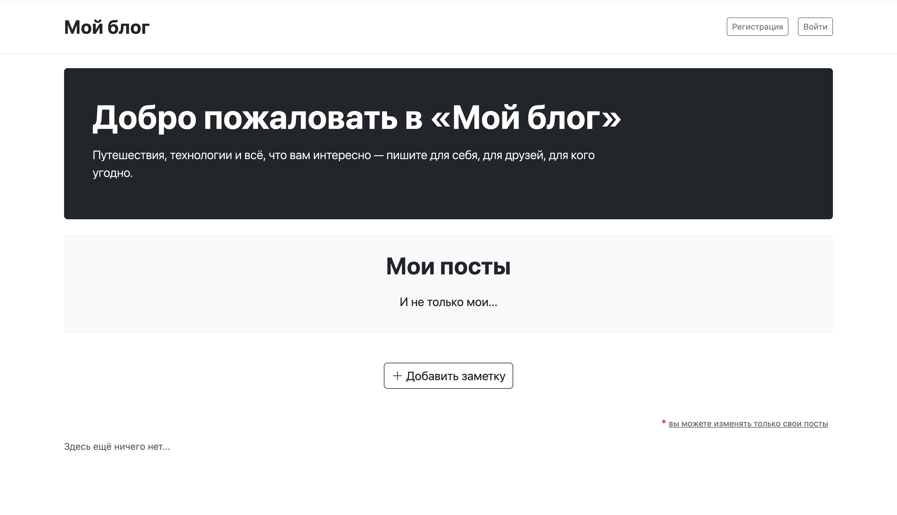
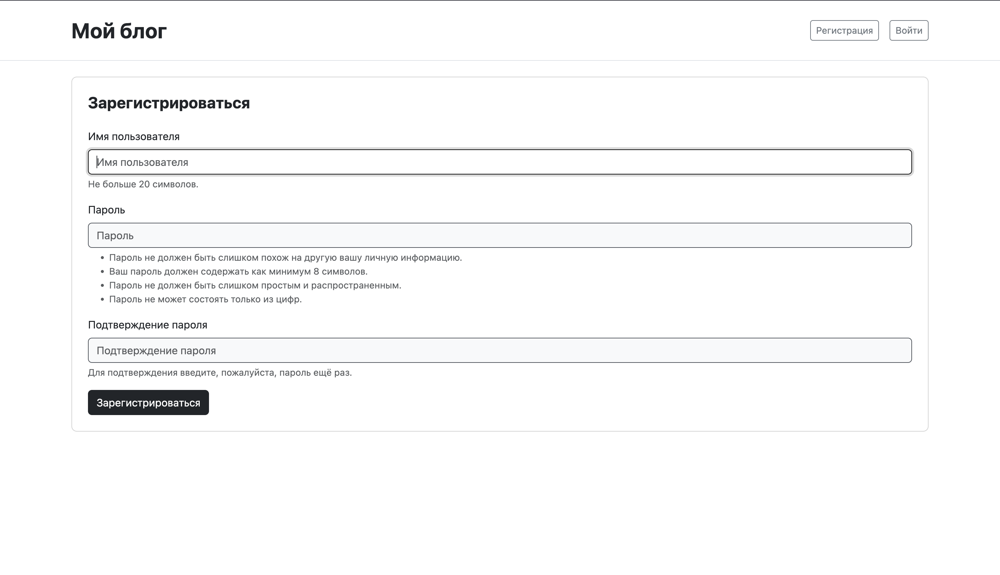
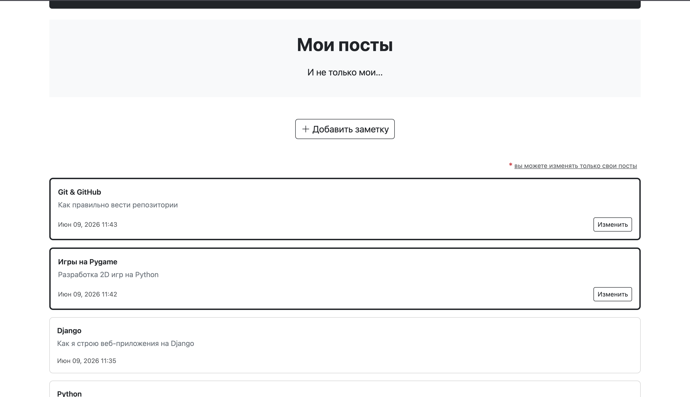
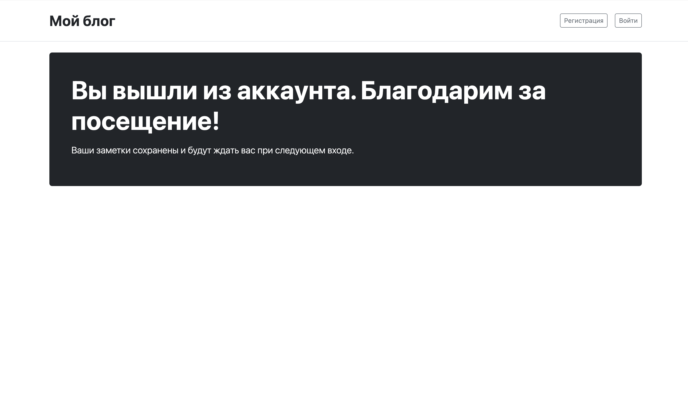

# Blog

A Django web app where users can register, log in, and publish blog posts.

## Live Demo

🔗 http://89.169.173.3:8080

## Screenshots






## Features

- User registration and authentication
- Create, edit, and delete posts
- Personal feed — each user sees their own posts
- Clean minimal interface

## Tech Stack

- Django
- Bootstrap
- SQLite
- Gunicorn + Nginx (deployed on VPS)

## Setup

```bash
pip install -r requirements.txt
python manage.py migrate
python manage.py runserver
```

## What I Learned

- Django's auth system: registration, login, logout out of the box
- Class-based views vs function-based views
- Restricting pages to logged-in users with `@login_required`
- How Django's ORM maps Python classes to database tables
